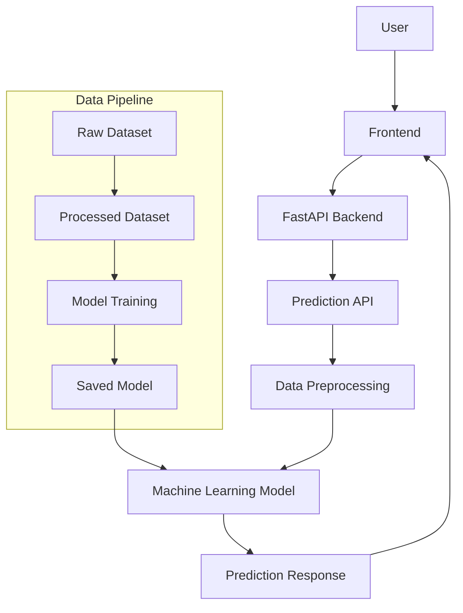

# Loan Default Prediction - System Architecture

## Project Architecture

## Overview

The system predicts whether a customer is likely to default on a loan based on the information provided in the loan application.

## Workflow

Customer
   ↓git
Register
   ↓
Login
   ↓
Fill Loan Application
   ↓
Submit Application
   ↓
Loan Officer Reviews Application
   ↓
Machine Learning Model Predicts
(Default / No Default + Risk Score)
   ↓
Loan Officer Approves or Rejects
   ↓
Customer Views Application Status

## Components

- Customer Portal
- Loan Application Form
- Database
- Machine Learning Prediction Model
- Loan Officer Dashboard
- Status Update System