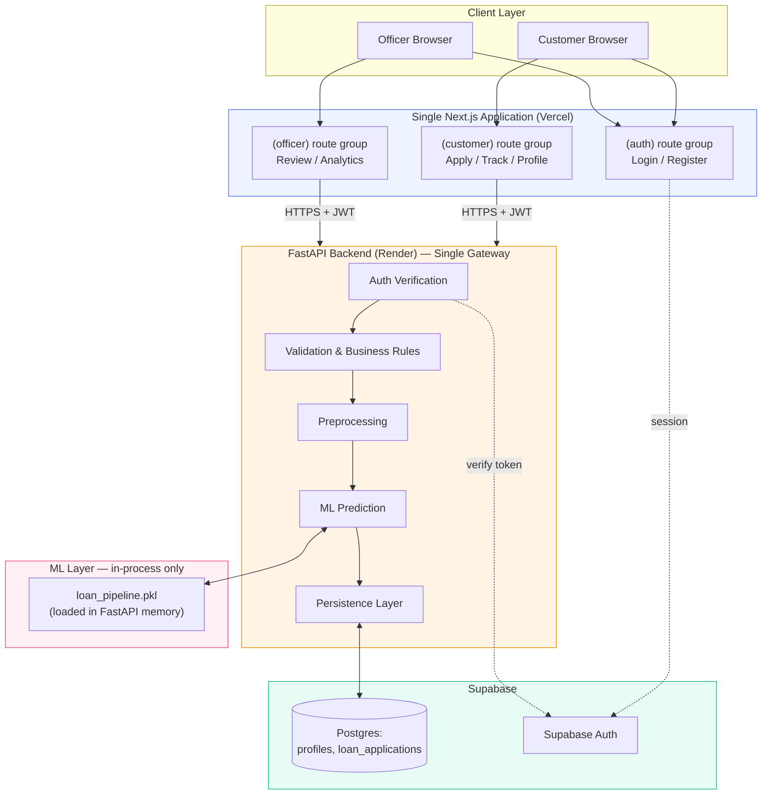
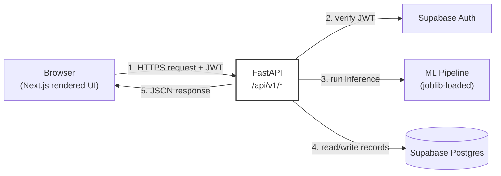
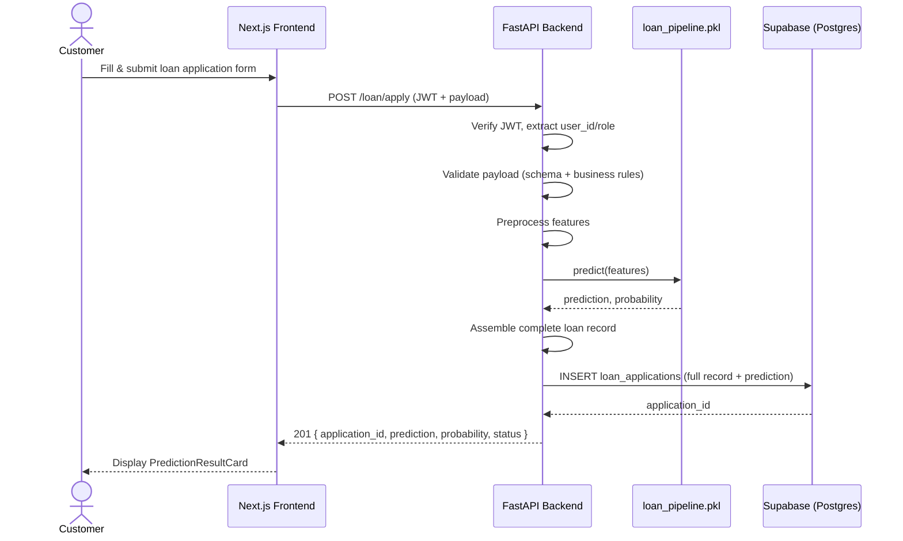
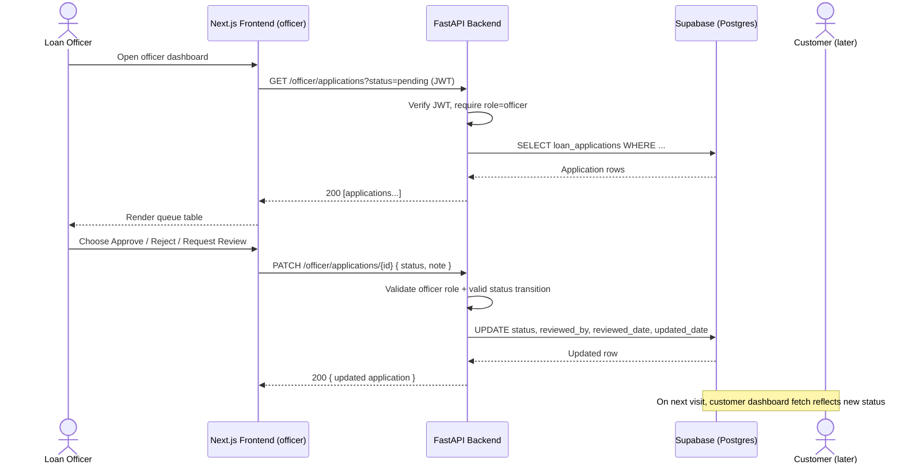
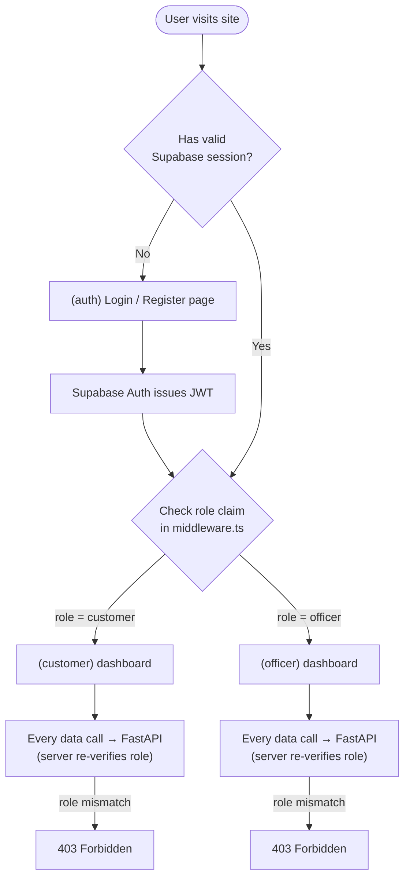
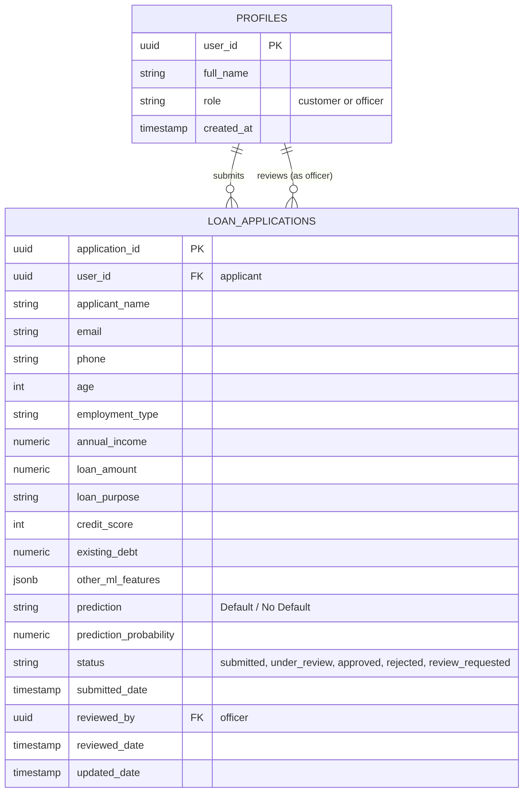
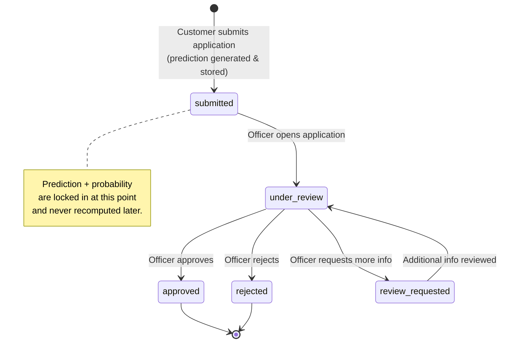
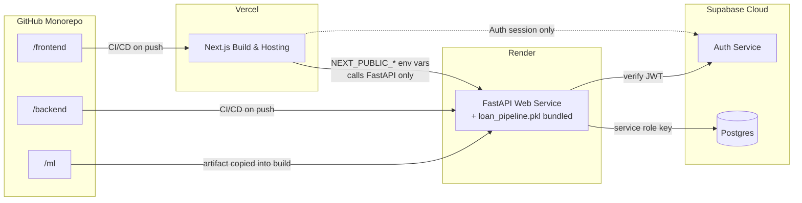
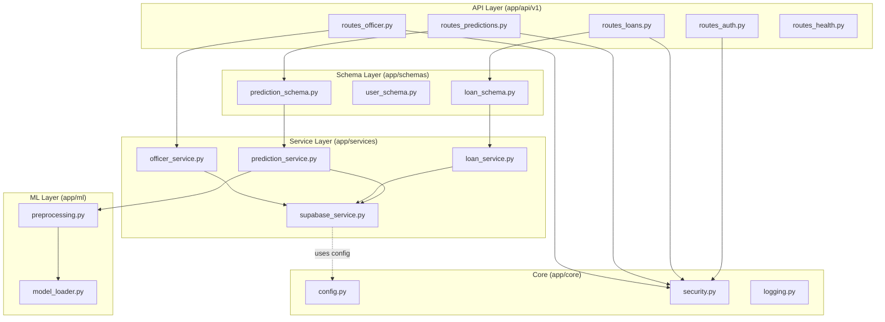

# Loan Default Prediction System — Architecture & Diagrams

This document consolidates the full system architecture and every diagram needed to understand how the system fits together: high-level architecture, component interaction, sequence flows, authentication flow, database ER diagram, deployment topology, and the loan status lifecycle.

> Diagrams are written in [Mermaid](https://mermaid.js.org/) syntax inside fenced code blocks. They render automatically on GitHub, GitLab, Obsidian, VS Code (with the Mermaid extension), and most modern Markdown viewers.

---

## Table of Contents

1. High-Level System Architecture
2. Component Interaction Diagram
3. Customer Loan Submission — Sequence Diagram
4. Officer Review — Sequence Diagram
5. Authentication & Role Routing Flow
6. Database ER Diagram
7. Loan Application Status Lifecycle (State Diagram)
8. Deployment Topology
9. Layered Architecture (Backend Internals)
10. Why This Architecture — Design Rationale Recap

---

## 1. High-Level System Architecture

**Key rule visualized:** there is no arrow from the Frontend directly into `ML` or into `Data` — every path is mediated by the FastAPI Backend.

---

## 2. Component Interaction Diagram

FastAPI is the only node with edges to every other component — the trust boundary is drawn around it deliberately.

---

## 3. Customer Loan Submission — Sequence Diagram

---

## 4. Officer Review — Sequence Diagram

---

## 5. Authentication & Role Routing Flow

**Important:** the frontend role check is for UX/routing convenience only. The authoritative check happens again on every FastAPI request — a customer JWT can never successfully call an officer-only endpoint, regardless of what the frontend renders.

---

## 6. Database ER Diagram

---

## 7. Loan Application Status Lifecycle (State Diagram)

---

## 8. Deployment Topology

---

## 9. Layered Architecture (Backend Internals)

---

## 10. Why This Architecture — Design Rationale Recap

- **Single gateway (FastAPI):** every business rule, validation step, and data mutation flows through one auditable service — no rule can be bypassed by calling Supabase or the model directly from the browser.
- **ML model isolated server-side:** the pipeline's schema, weights, and versioning stay private to the backend, and can be swapped/retrained without any frontend change.
- **Supabase kept "dumb":** used purely for Auth + Postgres storage, so all decisioning logic lives in one testable Python codebase rather than being split across database triggers and application code.
- **One Next.js app, two route groups:** avoids duplicated UI infrastructure while still giving customers and officers fully distinct experiences, gated by server-verified roles.
- **Prediction locked at submission time:** preserves an accurate, auditable record of what the model said when the applicant applied, independent of any later human review outcome.